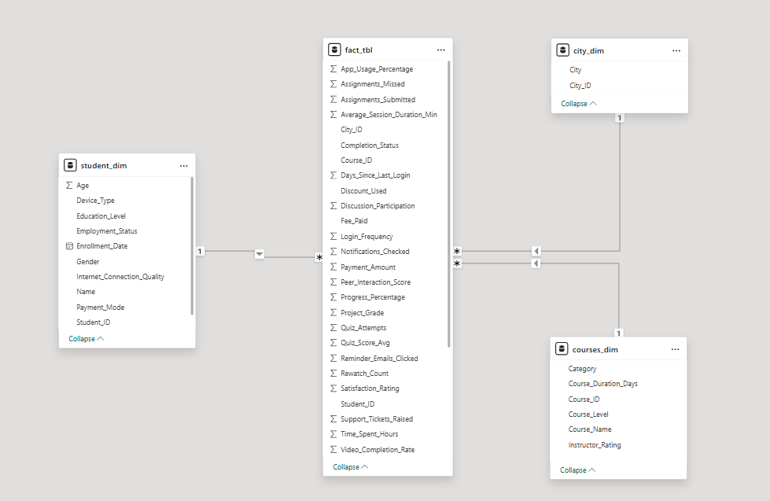
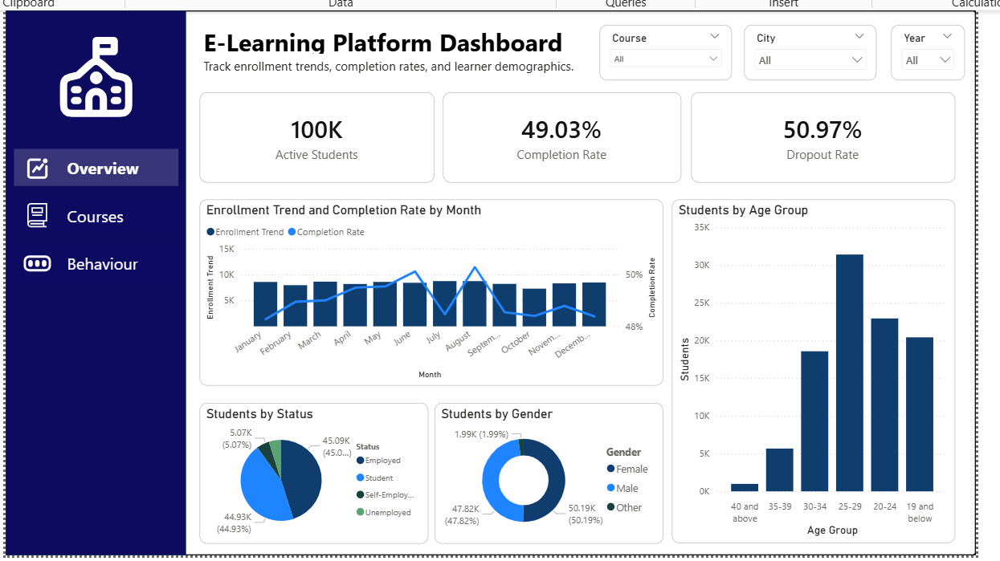
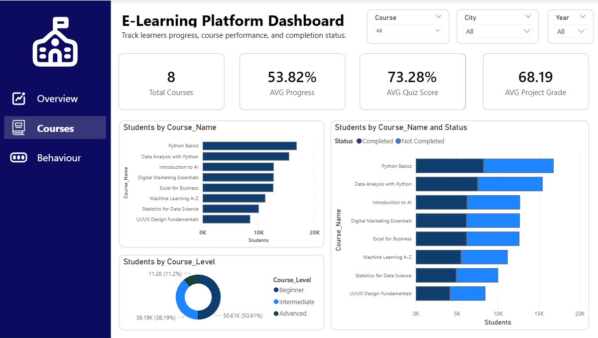
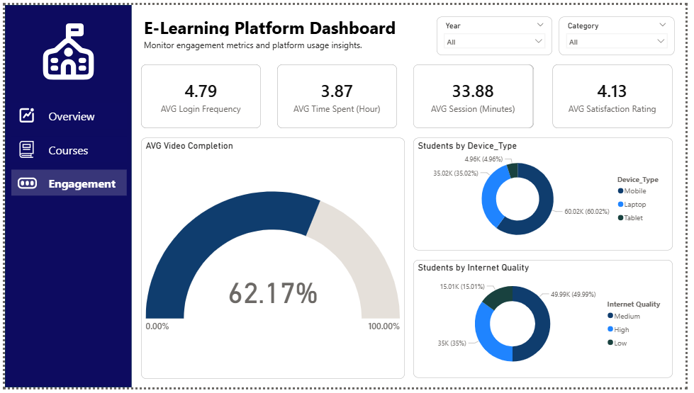

# 📊 Student Course Completion Prediction Dashboard

## Final Project Documentation in Data Analytics  
**Course:** C301 – 7ANALYTICS  

---

# 👥 Group 7

- Bulotano, Hana Mae P.  
- Lobo, Alexander  
- Reyes, Jael  
- Tisoy, Glory Ann  

### Instructor
Ma’am Marsha Superio  

### Date Submitted
May 15, 2026  

---

# 📌 Table of Contents

1. [Project Overview](#-i-project-overview)  
2. [Dataset Collection](#-ii-dataset-collection)  
3. [Data Preprocessing](#-iii-data-preprocessing)  
4. [Exploratory Data Analysis (EDA)](#-iv-exploratory-data-analysis-eda)  
5. [Data Modeling and Analytics](#-v-data-modeling-and-analytics)  
6. [Dashboard Development](#-vi-dashboard-development)  
7. [Dashboard Pages](#-vii-dashboard-pages)  
8. [Insights and Findings](#-viii-insights-and-findings)  
9. [Recommendations](#-ix-recommendations)  
10. [Real-World Interpretation](#-x-real-world-interpretation)  
11. [Conclusion](#-xi-conclusion)  
12. [Prepared By](#-xii-prepared-by) 

---

# 📌 I. Project Overview

The **Student Course Completion Prediction Dashboard** is a data analytics project designed to analyze student engagement, online learning behavior, academic performance, and course completion trends using interactive visual dashboards and descriptive analytics techniques.

The project utilized a real-world educational dataset containing demographic information, engagement metrics, learning behavior, course details, and completion records of students enrolled in online courses.

The primary purpose of this project is to transform raw educational data into meaningful insights that can help educators, administrators, and developers understand student behavior and improve learning outcomes.

Through analytics and visualization, the project demonstrates how engagement factors such as login frequency, time spent, internet quality, and session duration affect student success and course completion rates.

The project also highlights the importance of:
- Data cleaning and preprocessing
- KPI monitoring
- Dashboard visualization
- Data-driven decision making
- Student engagement analysis

---

# 📊 II. Dataset Collection

## 📁 Dataset Name
**Student Course Completion Prediction Dataset**

## 🔗 Dataset Source
Dataset obtained from Kaggle:

https://www.kaggle.com/datasets/nisargpatel344/student-course-completion-prediction-dataset

## 🧾 Dataset Description

According to the publisher (**NISARG PATEL**), the dataset contains detailed information regarding students enrolled in various online courses.

The dataset includes:
- Demographic information
- Behavioral data
- Academic performance metrics
- Learning engagement records
- Course information
- Completion status

The dataset is designed to help analyze and predict whether students complete or drop out of online courses.

## 📦 Dataset Size

| Category | Details |
|---|---|
| Total Records | 100,000 |
| Total Columns | 40 |
| File Format | CSV |

---

---

# 🧹 III. Data Preprocessing

The dataset underwent preprocessing using the **CLEAN Framework** to ensure data quality, reliability, and consistency.

---

## a. Conceptualize the Data

The dataset was first reviewed to understand its structure, relationships, and business context.

### Key Questions Answered

### What does each row represent?
Each row represents a student enrolled in an online course along with:
- Demographic information
- Engagement activity
- Learning behavior
- Academic performance
- Completion status

---

## 📊 Key Metrics Identified

The following metrics were identified for dashboard analytics:

- Total Active Students
- Completion Rate
- Dropout Rate
- Total Courses
- Average Progress
- Average Quiz Score
- Average Project Grade
- Average Time Spent
- Average Login Frequency
- Average Session Duration
- Average Satisfaction Rating
- Video Completion Rate
- Enrollment Trends
- Course Completion Count

---

## 🧩 Key Dimensions Identified

Dimension tables used:
- `student_dim`
- `courses_dim`
- `city_dim`

---

## b. Locate Solvable Problems

The following issues were identified and corrected:

### Duplicate Records
- Duplicate entries were removed to avoid inaccurate analysis.

### Inconsistent Formatting
- Corrected inconsistent text formatting
- Standardized categorical values
- Fixed capitalization inconsistencies

---

## c. Evaluate Unsolvable Issues

Some unavoidable inconsistencies were minimized through:
- Data normalization
- Data type conversion
- Standardization procedures

---

## d. Augment the Data

The cleaned dataset was enhanced to support:
- Dashboard reporting
- KPI calculations
- Visualization
- Data modeling
- Analytical reporting

---

## e. Note and Document

All preprocessing procedures were documented for:
- Transparency
- Reproducibility
- Data governance
- Reporting consistency

---

# 📈 IV. Exploratory Data Analysis (EDA)

EDA was conducted to identify patterns, trends, relationships, and distributions within the dataset.

---

# 📊 Summary Statistics Generated

## Measures of Central Tendency

- Mean Quiz Score
- Mean Project Grade
- Mean Progress Percentage
- Mean Satisfaction Rating
- Mean Session Duration
- Mean Login Frequency
- Mean Time Spent

---

## Frequency and Count Measures

- Total Active Students
- Total Course Enrollments
- Total Completed Students
- Total Non-Completed Students
- Students per Course

---

## Percentage and Rate Measures

- Completion Rate
- Dropout Rate
- Video Completion Percentage

---

## Distribution Analysis

The following distributions were analyzed:
- Gender Distribution
- Employment Status
- Course Level
- Device Type
- Internet Quality
- Monthly Enrollment Trends

### 📌 KPIs Used

The dashboard uses the following KPIs:

| KPI | Description |
|---|---|
| Total Active Students | Number of active learners |
| Completion Rate | Percentage of students who completed courses |
| Dropout Rate | Percentage of students who did not complete courses |
| Average Progress | Average learning progress percentage |
| Average Quiz Score | Mean quiz performance |
| Average Project Grade | Mean project performance |
| Average Login Frequency | Student activity frequency |
| Average Session Duration | Average learning session time |
| Average Satisfaction Rating | Student satisfaction level |

---

# 📌 V. Data Modeling and Analytics

The project used a **Star Schema** data model for efficient analytics and dashboard performance.

---

# ⭐ Star Schema

| Table Name | Type | Description |
|---|---|---|
| fact_tbl | Fact Table | Stores measurable student data |
| student_dim | Dimension Table | Student demographics |
| courses_dim | Dimension Table | Course information |
| city_dim | Dimension Table | Geographic data |
| cleaned_dataset | Source Table | Cleaned dataset before modeling |

---

# 📊 Descriptive Analytics

The project applied descriptive analytics techniques to summarize historical educational data.

---

## 1. Trend Analysis

- Monthly enrollment trends
- Student engagement trends
- Completion trends over time

---

## 2. Performance Analysis

- Average quiz scores
- Average project grades
- Course completion performance
- Student progress monitoring

---

## 3. Behavioral Analysis

- Login frequency patterns
- Session duration analysis
- Device usage trends
- Internet quality impact

---

## 4. Comparative Analysis

- Gender comparison
- Employment status comparison
- Course level comparison
- Course category comparison

---

# 📊 VI. Dashboard Development

The dashboard was developed using the **DASH Framework** to ensure usability, readability, and effective communication of insights.

---

# 🧠 DASH Framework

## D — Decision

The dashboard supports:
- Monitoring completion and dropout rates
- Evaluating course effectiveness
- Analyzing student engagement
- Tracking enrollment trends

---

## A — Audience

Target users include:
- Educators
- Developers
- Administrators
- Curriculum planners

The dashboard was designed to be:
- User-friendly
- Interactive
- Easy to understand
- Accessible to non-technical users

---

## S — Signal

The dashboard emphasizes key indicators including:
- Total Active Students
- Completion Rate
- Dropout Rate
- Average Progress
- Average Quiz Score
- Average Project Grade
- Login Frequency
- Session Duration
- Satisfaction Rating
- Enrollment Trends
- Course Completion Trends

---

## H — Hierarchy

Dashboard layout hierarchy:

### 1. KPI Cards
Displayed at the top for quick monitoring.

### 2. Charts and Visualizations
Used for trend and comparison analysis.

### 3. Interactive Filters and Slicers
Allow users to dynamically explore data.

---

# 📷 VII. Dashboard Pages

The dashboard contains three major pages:

### 🔍 Overview

### 📚 Courses Analysis

### 📈 Engagement Analysis

---

# 💡 VIII. Insights and Findings

## Insight 1
Students with higher engagement levels tend to complete courses more successfully.

### Evidence
Students with:
- Higher login frequency
- Longer session durations
- More time spent learning

showed:
- Higher completion rates
- Better academic performance

---

## Insight 2
Advanced courses have lower completion rates.

### Observation
Advanced-level courses had:
- More dropouts
- Lower completion percentages
- Reduced engagement

---

## Insight 3
Poor internet quality negatively affects student performance.

### Findings
Students with unstable internet:
- Logged in less frequently
- Spent less time learning
- Had lower progress percentages

---

## Insight 4
Most students use mobile devices for learning.

### Findings
Mobile phones were the most commonly used devices for online learning access.

---

## Insight 5
Higher-performing students report higher satisfaction ratings.

### Findings
Students with:
- Better quiz scores
- Higher project grades

also showed:
- Higher satisfaction levels

---

# ✅ IX. Recommendations

## 1. Increase Student Engagement

The platform should:
- Send reminders
- Add gamification features
- Improve progress tracking
- Encourage active participation

---

## 2. Support Difficult Courses

Advanced courses should provide:
- Additional tutorials
- Practice exercises
- Academic guidance
- Simplified explanations

---

## 3. Improve Mobile Optimization

The learning platform should:
- Optimize mobile responsiveness
- Improve smartphone accessibility
- Support tablet compatibility

---

## 4. Support Low-Bandwidth Users

Provide:
- Downloadable resources
- Lower-quality video options
- Offline learning materials

---

## 5. Monitor Student Performance Regularly

Educators should regularly monitor:
- Progress
- Login activity
- Completion status
- Quiz performance

---

# 🌍 X. Real-World Interpretation

The findings emphasize that:
- Student engagement significantly affects learning outcomes
- Accessibility impacts academic performance
- Technology quality influences online education success
- Mobile-first learning environments are essential
- Supportive learning systems improve completion rates

The project demonstrates how analytics and dashboards can help educational institutions improve online learning experiences through informed decision-making.

---

# 🏁 XI. Conclusion

The Student Course Completion Prediction Dashboard successfully demonstrated the importance of data analytics in understanding online learning behavior and student performance.

Using dashboard visualization, KPI monitoring, descriptive analytics, and data modeling, the project transformed complex educational data into meaningful and actionable insights.

The study highlighted how engagement metrics such as:
- Login frequency
- Session duration
- Time spent
- Internet quality

strongly influence student success and course completion.

Overall, the project proves that data analytics can help educational institutions:
- Improve learning strategies
- Identify at-risk students
- Enhance online platforms
- Support data-driven decision making

---

# 👥 XII. Prepared By

## Group 7

- Bulotano, Hana Mae P.  
- Lobo, Alexander  
- Reyes, Jael  
- Tisoy, Glory Ann  

---

# 📬 Submitted To

Ma’am Marsha Superio  
Instructor, 7Analytics
