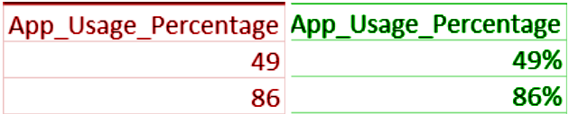
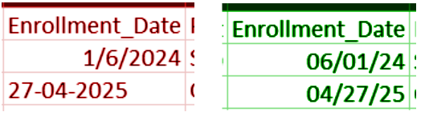

# 📊 E-Learning Platform Dashboard
## Final Project Documentation in Data Analytics  
**Course:** C301 – 7ANALYTICS  

---

# 👥 Group 7

- Bulotano, Hana Mae P.  
- Lobo, Alexander  
- Reyes, Jael  
- Tisoy, Glory Ann  

### Instructor
Ma’am Marsha Superio  

### Date Submitted
May 15, 2026  

---

# 📌 Table of Contents

1. [General Overview](#-i-general-overview)  
2. [Dataset Collection](#-ii-dataset-collection)  
3. [Data Preprocessing](#-iii-data-preprocessing)  
4. [Exploratory Data Analysis (EDA)](#-iv-exploratory-data-analysis-eda)  
5. [Data Modeling and Analytics](#-v-data-modeling-and-analytics)  
6. [Dashboard Development](#-vi-dashboard-development)  
7. [Dashboard Pages](#-vii-dashboard-pages)  
8. [Insights and Recommendations](#-viii-insights-and-recommendations)  
9. [Real-World Interpretation](#-ix-real-world-interpretation)  
10. [Conclusion](#-x-conclusion)  
11. [Prepared By](#-xi-prepared-by) 

---

# 📌 I. General Overview

This project is focused on analyzing student engagement, course performance, and online learning behavior using data analytics techniques and interactive dashboard visualization. The study utilized a real-world dataset containing student information, course details, engagement metrics, and completion records to identify important trends and patterns within an online learning environment.

---

Overall, the project demonstrated how data analytics and visualization tools helped interpret large datasets, transform raw information into meaningful insights, and support data-driven decision-making in an educational context. The findings provided a clearer understanding of how student engagement influenced course completion and performance, highlighting the importance of consistent participation and effective learning strategies in online education. Through the use of structured data modeling and interactive dashboards, the study made complex data more accessible and easier to interpret for stakeholders such as educators, administrators, and curriculum developers. This enabled them to identify areas for improvement, design targeted interventions, and enhance the overall learning experience.

---

# 📊 II. Dataset Collection

## 📁 Dataset Name
**Student Course Completion Prediction Dataset**

## 🔗 Dataset Source
Dataset obtained from Kaggle:

https://www.kaggle.com/datasets/nisargpatel344/student-course-completion-prediction-dataset

## 🧾 Dataset Description

As noted by the publisher (NISARG  PATEL), this dataset provides detailed information about students enrolled in various online courses. It includes demographic, behavioral, and performance features to predict whether a learner will complete the course or drop out.

## 📦 Dataset Size

| Category | Details |
|---|---|
| Total Records | 100,000 |
| Total Columns | 40 |
| File Format | CSV |

---

---

# 🧹 III. Data Preprocessing

The project followed the **CLEAN Framework**, as instructed,  to ensure the dataset was accurate, consistent, reliable, and ready for analytics and visualization. The CLEAN Framework guided the preprocessing stage by organizing the cleaning procedures into systematic steps.

---

## a. Conceptualize the Data

The dataset was initially reviewed and analyzed to understand its structure, content, and quality before preprocessing. The techniques used to achieve a clean dataset are the following: 

### Key Questions Answered

### What does each row represent?
Each row in the dataset represents one student enrolled in an online course along with their demographic information, learning behavior, engagement activity, academic performance, and course completion status.

---

### What are the key metrics.

Key Metrics used in the dashboard:

- Total Active Students
- Completion Rate
- Dropout Rate
- Total Courses
- Average Progress
- Average Quiz Score
- Average Project Grade
- Average Time Spent
- Average Login Frequency
- Average Session Duration
- Average Satisfaction Rating
- Video Completion Rate
- Enrollment Trends
- Course Completion Count

---

### What are the key dimensions?

Dimension tables used:
- `student_dim`
- `courses_dim`
- `city_dim`

### Replacing inconsistent data format using suitable methods

  
### Validation of corrected entries.

---

## b. Locate Solvable Problems
### Duplicate Records
- Duplicate entries were detected and removed to avoid inconsistencies and inaccurate analysis. 

### Inconsistent Formatting

---

## c. Evaluate Unsolvable Issues

Certain data limitations and unavoidable inconsistencies were evaluated to minimize their impact on analysis. The dataset underwent several transformations including:

Some unavoidable inconsistencies were minimized through:
- Data normalization
- Data type conversion

---

## d. Augment the Data

The cleaned dataset was enhanced and validated to ensure accuracy, consistency, and proper structure for analytics and reporting. This final stage prepared the dataset for exploratory data analysis, KPI generation, dashboard creation, and data-driven insights.

---

## e. Note and Document
All preprocessing procedures were documented.

---

# 📈 IV. Exploratory Data Analysis (EDA)

The following statistical measures were generated from the fact_tbl to analyze student performance, engagement, enrollment behavior, and course completion trends within the dashboard.

---

# 📊 Summary Statistics Generated

## Measures of Central Tendency

- Mean Quiz Score
- Mean Project Grade
- Mean Progress Percentage
- Mean Satisfaction Rating
- Mean Session Duration
- Mean Login Frequency
- Mean Time Spent

---

## Frequency and Count Measures

- Total Active Students
- Total Course Enrollments
- Total Completed Students
- Total Non-Completed Students
- Students per Course

---

## Percentage and Rate Measures

- Completion Rate
- Dropout Rate
- Video Completion Percentage

---

## Distribution Analysis

The following distributions were analyzed:
- Gender Distribution
- Employment Status
- Course Level
- Device Type
- Internet Quality
- Monthly Enrollment Trends

### 📌 KPIs Used

The dashboard utilized several KPIs and analytical measures following the Pyramid Framework to monitor educational performance and platform engagement.

| KPI | Description |
|---|---|
| Total Active Students | Number of active learners |
| Completion Rate | Percentage of students who completed courses |
| Dropout Rate | Percentage of students who did not complete courses |
| Average Progress | Average learning progress percentage |
| Average Quiz Score | Mean quiz performance |
| Average Project Grade | Mean project performance |
| Average Login Frequency | Student activity frequency |
| Average Session Duration | Average learning session time |
| Average Satisfaction Rating | Student satisfaction level |

### Visualization Used
The dashboard included multiple visualizations such as:

- Bar Charts
- Donut Charts
- Pie Charts
- KPI Cards
- Gauge
- Slicers

---

# 📌 V. Data Modeling and Analytics

The project applied data modeling techniques to organize and analyze the dataset efficiently. 

---

# ⭐ Star Schema

| Table Name | Type | Description |
|---|---|---|
| fact_tbl | Fact Table | Stores measurable student data |
| student_dim | Dimension Table | Student demographics |
| courses_dim | Dimension Table | Course information |
| city_dim | Dimension Table | Geographic data |
| cleaned_dataset | Source Table | Cleaned dataset before modeling |

---

# 📊 Descriptive Analytics

The project applied descriptive analytics techniques to summarize historical educational data.

---

## 1. Trend Analysis

- Monthly enrollment trends
- Student engagement trends
- Completion trends over time

---

## 2. Performance Analysis

- Average quiz scores
- Average project grades
- Course completion performance
- Student progress monitoring

---

## 3. Behavioral Analysis

- Login frequency patterns
- Session duration analysis
- Device usage trends
- Internet quality impact

---

## 4. Comparative Analysis

- Gender comparison
- Employment status comparison
- Course level comparison
- Course category comparison

---

# 📊 VI. Dashboard Development

The Dashboard was designed to provide quick access to important metrics, improve decision-making, to present data visually and interactively and simplify interpretation of large datasets. It follows the DASH Framework to guide the design and development.

---

# 🧠 The DASH Framework consists of the following components:

## D — Decision

The dashboard was designed to support important educational and management decisions related to student engagement, course performance and online learning behaviour.

### The dashboard helped stakeholders:

The dashboard supports:
- Monitoring completion and dropout rates
- Evaluate course performance and effectiveness.
- Analyze trends in enrollment and participation.

---

## A — Audience

The primary audience of the dashboard includes:

- Educators
- Developers
- Administrators

The dashboard was designed to be user-friendly and accessible even for users without advanced analytical knowledge. Clear visualizations, KPI cards, filters, and organized layouts helped users quickly understand and interpret the data.

---

## S — Signal

The dashboard focused on highlighting the most important signals or key indicators that reflect student engagement, learning performance, and platform activity.

- Total Active Students
- Completion Rate
- Dropout Rate
- Average Progress
- Average Quiz Score
- Average Project Grade
- Login Frequency
- Session Duration
- Satisfaction Rating
- Enrollment Trends
- Course Completion Trends

These signals helped identify patterns, trends, strengths, and potential problem areas within the online learning platform.

---

## H — Hierarchy

Dashboard layout hierarchy:

The dashboard followed a clear visual hierarchy to guide users through the information from high-level insights to detailed analysis.

### The dashboard structure followed this flow:

### 1. KPI Cards
Displayed at the top for quick monitoring.

### 2. Charts and Visualizations
Used for trend and comparison analysis.

### 3. Interactive Filters and Slicers
Allow users to dynamically explore data.

---

# 📷 VII. Dashboard Pages

The dashboard contains three major pages:

### 🔍 Overview

### 📚 Courses Analysis

### 📈 Engagement Analysis

---

# 💡 VIII. Insights and Recommendations

##  Actionable Insights
Based on the data analyzed in the dashboard, several important patterns and trends were identified regarding student engagement, course performance, and learning behavior.

## Insight 1
Students with higher engagement levels tend to complete courses more successfully.

- The dashboard showed that students with higher login frequency, longer session durations, and more time spent on the platform usually had higher completion rates and better academic performance.

---

## Insight 2
Advanced courses have lower completion rates.

- The analysis showed that advanced-level courses had fewer completed students compared to beginner and intermediate courses.

---

## Insight 3
Poor internet quality negatively affects student performance.

- Students with poor internet connection quality generally showed lower engagement, shorter session durations, and lower progress percentages.

---

## Insight 4
Most students use mobile devices for learning.

- The dashboard indicated that many students access the platform using mobile phones rather than laptops or tablets.

---

## Insight 5
Higher-performing students report higher satisfaction ratings.

- Students who achieved higher quiz scores and project grades also showed higher satisfaction ratings.

---

##  Data-Driven Recommendations
Based on the findings from the dashboard, the following recommendations are suggested to improve student engagement and course performance.

## Recommendation 1
Encourage students to participate more actively

- The platform can improve student engagement by adding learning reminders, interactive activities, progress tracking features, and reward systems.

## Recommendation 2
Provide additional support for difficult courses

- Advanced courses may include extra tutorials, practice activities, simplified explanations, and academic guidance.

## Recommendation 3
Improve mobile accessibility

- The learning platform should be optimized for smartphones and tablets.

## Recommendation 4
Support students with poor internet connections

- The platform can provide downloadable materials, lower-quality video options, and offline learning support.

## Recommendation 5
Monitor student activity regularly

- Teachers and administrators should regularly monitor student progress, login frequency, quiz scores, and completion status.
  
---

# 🌍 IX. Real-World Interpretation

The findings suggest that student participation and accessibility greatly affect success in online learning environments. Students who are more active and spend more time engaging with lessons are more likely to complete their courses and perform better academically. The results also show that difficult courses and unstable internet connections can create challenges that may reduce student progress and completion rates. Since many students rely on mobile devices for learning, online platforms should be designed to work efficiently on smartphones and tablets. Overall, the analysis highlights the importance of student engagement, accessible technology, and supportive learning environments in improving academic performance and online learning experiences.

---

# 🏁 X. Conclusion

The Dashboard successfully demonstrated the importance of data analytics in understanding online learning behavior and student performance.

Using dashboard visualization, KPI monitoring, descriptive analytics, and data modeling, the project transformed complex educational data into meaningful and actionable insights.

The study highlighted how engagement metrics such as:
- Login frequency
- Session duration
- Time spent
- Internet quality

strongly influence student success and course completion.

Overall, the project proves that data analytics can help educational institutions:
- Improve learning strategies
- Enhance online platforms
- Support data-driven decision making

---

# 👥 XI. Prepared By

## Group 7

- Bulotano, Hana Mae P.  
- Lobo, Alexander  
- Reyes, Jael  
- Tisoy, Glory Ann  

---

# 📬 Submitted To

Ma’am Marsha Superio  
Instructor, 7Analytics
